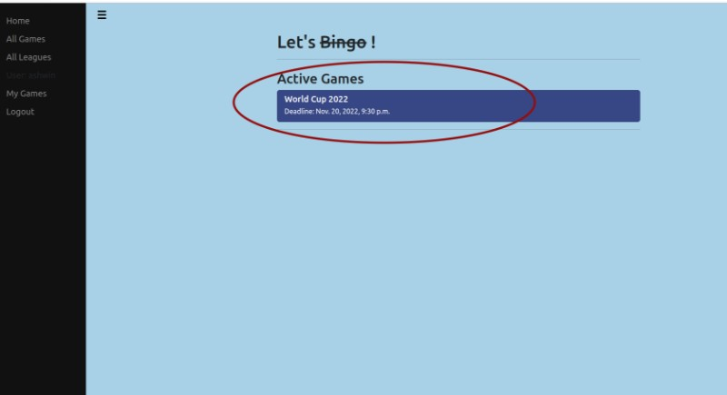
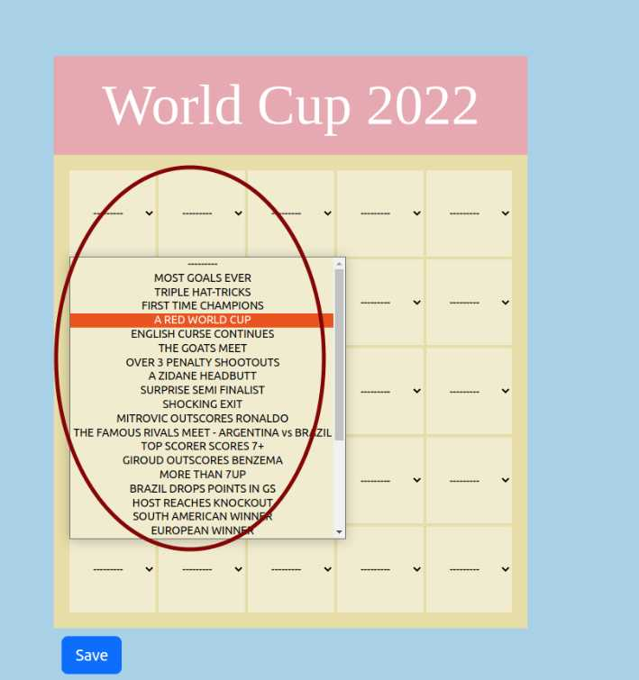
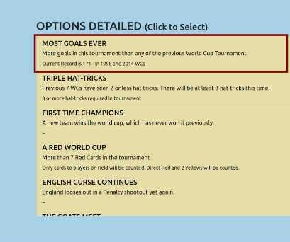
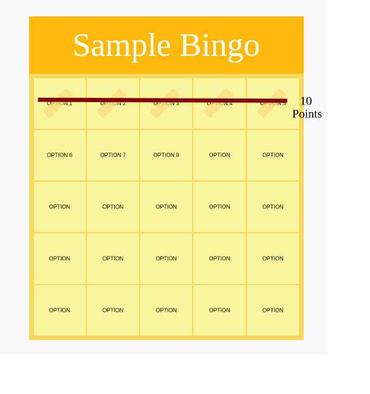
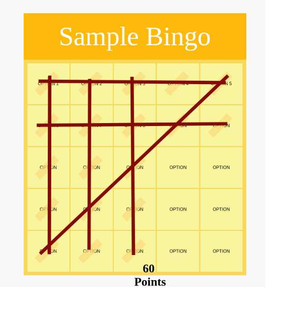

# Django Bingo Game

A BINGO Game initially designed for FPL(Fantasy Premier League), but can be used to create custom bingo game. 
This is not the usual Bingo with just numbers. But a game where custom options are present, 
and to play, players can create their cards using these custom options.


***
## Features

- Admin can create a League.
- Admin can create a "Game" (3X3 or 5X5) and:
  - Add Game to a League. 
  - Add "GameOptions" to the Game(Options to select in a Card).
  - Set a deadline for the Game.
- Users can login using 3 methods:
  - Email/Password combination
  - Google account
  - Reddit account
- Users can login and create their own card using the GameOptions added by admin.
- Post the deadline, users will be able to see the cards of the other users in the league standings.
- Once the game is completed:
  - The Admin can mark the "GameOptions" which are done from the admin dashboard
  ("These options will be crossed in the card").
  - Once all the required GameOptions has been marked has done, admin can calculate the score of users.
  - The users will be able to see their score and standings on the League Standings section.

***

## GamePlay

### 1. Select any one of active Games:
  

### 2. Select your options.
  #### a. Either from dropdown in the card.
  

  #### b. Or select choices from "OPTIONS DETAILED" section in the right.
  

### 3. Save your selections.

***

## Scoring

#### A Player need to have get 5 cards covered either Vertically, Horizontally, or Along the Main Diagonals to get a BINGO LINE.

#### Each BINGO LINE will be of 10 points.

  ### Sample 1:
  

  ### Sample 2:
  

***

## For Admins:
### Setup and Deployment:
- The current deployment setup is done as for Railway.app.
- The Procfile in root directory is used by railway for build/deployment.
- Secrets and variables can be directly while configuring the application in Railway.

### To Run in Local:

1. Clone the repository:
   ```bash
   git clone https://github.com/ashwinss3/BingoGame.git
   ```

2. Navigate to the project directory:
   ```bash
   cd BingoGame
   ```

3. Install dependencies:
   ```bash
   pip install -r requirements.txt
   ```

4. Apply database migrations:
   ```bash
   python manage.py makemigrations && python manage.py migrate
   ```

5. Run the development server:
   ```bash
   python manage.py runserver
   ```

NOTE: Pycharm run configuration is already present in the project. 
The same can be used to run the project directly on local, after adding environment variable and necessary migrations.


## Contributing
Contributions are welcome! If you'd like to improve this Bingo game or add new features, feel free to fork the repository and submit a pull request.

Note: Feel free to update the designs. HTML/CSS weren't my strong areas. :)

## License

This project is licensed under the MIT License. See the [LICENSE](./LICENSE) file for details.


***
# LET'S PLAY !!!
***
***


<!---
Steps:
1. Create a Django Server with a Static HTML
2. Create a PAGE where Admin can create a BINGO GAME and add options.
3. Create a page where USER can select and Save their Bingo options for a GAME.
4. An ENDPoint to update the GAME options.
5. Calculate the score of the users


Models:
1. League - id, game_ids (one to many)
1. Game - id, name, choices, end_time,
2. Options - id, name, is_done,
3. UserGame - game_id, user_id, user_choices, score
4. User - name, user_id, password, reddit_user_name
6. League Standings - league_id, user_id, score, position, prev_position.
7. UserChoices - TO store choice of user for a game

Choices can be stored in a single array.Calculation can be done based by using formula based on positions


Sep 18:
TODOS:
Reset password flow
-->
